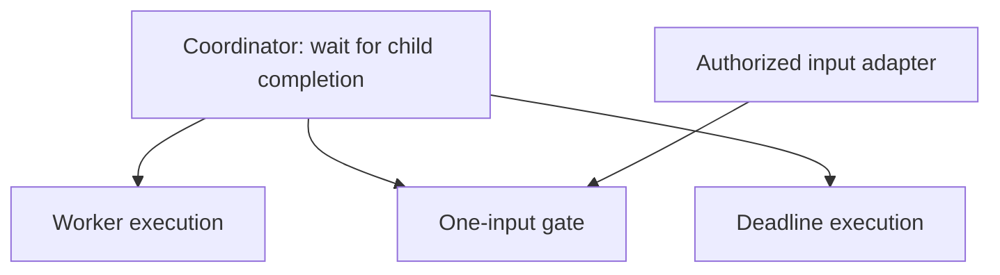

# Building a general agent and harness framework

Scope's `agent` module is a general agent and harness framework. It must support model-directed agents, planners, workflows, reactive coordinators, and compositions that the framework authors have not anticipated. This design explains the execution guarantees those agents share, where their behavior can vary, and how to prove that a new capability composes without creating another runtime.

The [Agent package contract](../agent/doc.go) and checked examples describe implemented behavior. This document distinguishes those guarantees from stronger candidate extensions and explains their architectural constraints. Candidate extensions do not announce new APIs or guarantees; each implementation change still needs its own contract, impact review, and executable acceptance cases.

This document addresses framework and strategy authors. It owns the architectural reasoning across Agent, capability adapters, and the embedding application. It follows [Scope's design philosophy](../DESIGN_PHILOSOPHY.md); package GoDoc remains the sole module entry point and API authority.

## Generality means preserving guarantees under composition

A harness manages the execution around an agent's decisions: admitting input, scheduling work, delivering results, bounding resources, processing control requests, and recovering interrupted execution. A strategy decides which work to request and how to interpret its results. Neither definition requires a model call, a conversation, or a particular multi-agent topology.

The central requirement is:

> A new strategy uses public contracts to obtain managed execution, input delivery, effect settlement, resource ownership, and recovery. The resulting capability can itself participate in another strategy without losing those guarantees.

A framework meets this requirement through observable properties:

1. **Behavior is open.** An independently authored strategy can implement a new decision procedure without editing an Engine strategy switch.
2. **Composition preserves contracts.** Nested operations retain their input and output validation, authority, budgets, control behavior, and recovery identities.
3. **Ownership remains singular.** A composition does not create a competing scheduler, mailbox, effect journal, or lifecycle authority.
4. **Recovery preserves decisions.** A restart reconstructs every fact needed to continue, including ambiguous external outcomes.
5. **Policy stays explicit.** Selection, business success, retries, and stopping criteria belong to the strategy that chooses them.
6. **Public contracts are sufficient.** Official and third-party strategies use the same interfaces and conformance requirements.

Arbitrary callbacks or opaque payloads establish extensibility of representation. They do not establish these execution properties. A callback that starts an unmanaged goroutine can express behavior while losing cancellation, accounting, and recovery.

The design must also keep composition usable. Requiring every application to reconstruct the same coordination state machine is evidence for a reusable higher-level capability. Such a capability can belong to Scope while compiling to the existing runtime.

## Lessons from extensible systems

The Famicom and Dougong illustrate two complementary requirements: an extension boundary must admit new behavior, and composed behavior must retain common ownership rules.

### Famicom: a stable interface can admit active extensions

Famicom cartridges contain program data and can contain additional circuitry. Mappers change how cartridge memory appears in the console's address spaces. MMC3 also implements an interrupt counter; the cartridge connector exposes the signals that make such behavior possible. These are hardware facts, not proposed Scope APIs. See the NESdev references for [mappers](https://www.nesdev.org/wiki/Mapper), [MMC3](https://www.nesdev.org/wiki/MMC3), and the [cartridge connector](https://www.nesdev.org/wiki/Cartridge_connector).

The useful architectural correspondence is:

| Hardware role | Scope correspondence | Design consequence |
| --- | --- | --- |
| Console | Engine and its execution protocol | Common execution rules do not enumerate application behavior |
| Cartridge | An exact Deployment binding | Behavior includes implementation and configuration, not only a name |
| Program | Definition and Execution | A strategy owns its decisions and serializable state |
| Mapper adaptation | Strategy protocol translation and external Dispatcher adaptation | Extensions interpret their own domain operations through an explicit boundary |
| Bus signals | Effects, Signals, transitions, and lifecycle contracts | The boundary defines when an interaction takes effect and what it means |

This correspondence does not require a `Mapper` interface. The responsibilities already have owners in Scope. Adding the analogy's nouns would not supply missing execution semantics.

An extension can add domain behavior, but it cannot privately redefine the meaning of committed input, cancellation, or an uncertain effect. Mutable state that affects a strategy's continuation belongs in its Execution state. State owned by an external system must be observed through explicit operations and identified results.

### Dougong: higher-level capabilities expand through public primitives

Dougong distinguishes stable Services, dynamic ExtensionPoint contributions, transient Events, and structured Lifetimes. These concepts have different temporal and ownership semantics. Its architecture requires advanced capabilities to use the same public primitives as ordinary plugins. See the [Dougong architecture](https://github.com/Tangerg/dougong/blob/6f63cbc6f5903adb83d58fbd713a76aec5514864/docs/en/reference/architecture.md).

Three concrete designs inform Scope:

- **Preserve information before applying policy.** Dougong exposes the complete contribution set. Its Planet player selects a source for each query without putting media-selection policy in Core. Agent should likewise preserve relevant results and failure facts while strategies decide which results satisfy their goals.
- **Compile orchestration to one authority.** Dougong Platform translates a change into one Core ChangeSet. An Agent composition should declare work through the canonical execution protocol, with the existing runtime owning its effects and commits.
- **Compose resource ownership with behavior.** Dougong Lifetime cancels owned work before joining it, then releases resources. An Agent strategy should not need a second cancellation registry to control work already owned by its runtime.

The implementations make these boundaries concrete: [source selection and playback ownership](https://github.com/Tangerg/dougong/blob/6f63cbc6f5903adb83d58fbd713a76aec5514864/packages/examples/src/09-planet.ts), [Platform-to-Core compilation](https://github.com/Tangerg/dougong/blob/6f63cbc6f5903adb83d58fbd713a76aec5514864/packages/platform/src/core-change.ts), and [Lifetime disposal](https://github.com/Tangerg/dougong/blob/6f63cbc6f5903adb83d58fbd713a76aec5514864/packages/core/src/lifetime.ts).

Scope must preserve the differences between the systems. A Dougong Event is transient; an Agent Signal participates in recovery. Releasing a live resource cannot erase durable deduplication facts. Neither an in-memory graph transaction nor an Agent tree commit can undo an external side effect merely because local execution failed.

## One owner for each responsibility

The existing Definition, Execution, Deployment, Dispatcher, Process, and Engine separation remains the architectural foundation. Generality comes from completing their contracts and composing them, without introducing a second plugin system or execution hierarchy.

| Owner | Responsibility | Variation it admits |
| --- | --- | --- |
| Definition | Immutable strategy behavior, input contract, creation, and restoration | New strategies and pure decision policies |
| Execution | One strategy's private state and bounded reductions | Plans, contexts, coordination state, and domain transitions |
| Deployment | Exact binding of behavior and external interpretation | Explicit implementation and configuration selection |
| Dispatcher | Execute one declared external operation and report its settlement | Models, tools, sensors, storage, transports, and other adapters |
| Process | Identity and lifecycle of one managed logical execution | Independent child work with explicit allocations |
| Root tree runtime | Scheduling, authoritative commits, input facts, effect settlement, and recovery | Heterogeneous Processes using one execution protocol |
| Reusable composition | A higher-level operation expressed through these contracts | Races, input gates, feedback loops, routing, and coordination |
| Embedding application | Product identity, deployment selection, transport and persistence integration, and product policy | Sessions, installations, billing, user interfaces, and deployment catalogs |

These are responsibility boundaries, not a requirement for a package or interface per row. A concrete type is sufficient where no substitution boundary exists. Consumer-defined interfaces expose only the methods required at an actual boundary.

The root tree remains the commit and recovery unit. Process parentage records ownership; it does not describe every possible business relationship. A task graph, discussion graph, or dependency graph can be strategy data, while the work that executes it has explicit Process owners.

Ephemeral and durable execution use the same state machine. Crash recovery requires the configured durability port and the embedding application's storage and binding guarantees. In durable mode, input admission and effect boundaries acknowledge their authoritative tree commits; ephemeral execution makes no corresponding storage promise. A composition inherits its execution mode and cannot claim stronger persistence merely because it uses Signals.

Routing a new conversation turn to another agent does not inherently require reparenting an active Process. Changing ownership of in-flight work is a stronger operation that affects budgets, cancellation, and recovery. It needs an independent requirement.

Communication authority must also be explicit. A Process ID identifies a destination; a delivery adapter must separately establish permission to act on that destination. Existing Host-facing Process handles expose control operations; they are not attenuated recipient tokens. Declared capabilities constrain Dispatcher Effects and child grants, but same-process Go code is not a security sandbox.

## An open domain protocol with common execution semantics

The runtime should understand the lifecycle of work without understanding what that work means to a particular agent. New model, tool, planning, and collaboration vocabularies remain in the packages that own them.

The current structural operations are `RequestWait`, `StartChild`, `WaitForChildren`, `SignalChild`, and `CancelChild`. The last two control an exact direct child through the tree owner. A strategy requests other external work through its Deployment-bound Dispatcher. Transitions determine whether the Process continues, waits, pauses, completes, or fails. This is a shared execution protocol, not a registry of agent-specific hooks. See [Effects](../agent/effect.go), [child controls](../agent/child_control.go), and [transitions](../agent/transition.go).

### Decisions and inputs

An Execution reduces committed state and an ordered Signal window into a candidate transition. It performs no external input/output, reads no ambient clock or randomness, and starts no unmanaged work. The runtime adopts valid candidate state through its existing commit boundary. See [Definition and Execution](../agent/definition.go).

Time, random choices, retrieved context, and changes in external state can influence decisions. They enter as explicit input or effect results. A reference to external data must identify the content or revision required for the decision; rereading an unspecified latest value during restoration would change its meaning.

Input admission and input consumption are distinct operations. The mailbox can accept input while a Step runs, but that input belongs to a later window. A failed candidate cannot permanently consume its inputs.

### External effects

An Effect declares an operation; its Dispatcher interprets the operation outside Step. The Engine assigns stable identity and owns the planned, pending, and settled phases. The Dispatcher returns a definite result or an outcome the runtime must treat as unknown. See [Dispatcher](../agent/dispatcher.go).

The prepared batch has one execution frontier. Effects advance in declaration order, and external dispatch does not make a batch of real-world operations atomic. Independent work that needs concurrency can execute in separate child Processes.

Direct-child controls have a narrower atomic boundary: the recipient change and the parent's definite control settlement commit in one tree cut. They require no external pending attempt. The recipient cannot consume the new Signal before that cut is acknowledged. This guarantee applies to the declared direct-child operation, not to the whole Effect batch or arbitrary peer communication.

An adapter may keep implementation caches and own resources for an active call. It must not keep unrecorded per-Process decision state that recovery requires. A subscription or background task needs an explicit owner, stopping condition, and recovery contract; returning from Dispatch cannot silently detach it.

Replay safety belongs to the exact external operation. `ReplayPolicySameIdentity` permits replay only when the adapter can prove the repeated identity represents the same operation. Recovery of a pending attempt can use that declaration; an already settled Unknown still requires explicit adjudication. Replay permission does not define a framework-wide retry mechanism.

### Signals, results, and observations

The framework must preserve the distinction between reliable decision input, final results, and observations. Signal admission participates in the mailbox and durable tree state. Output is the strategy's final business result. Events and Delta values describe execution and streaming observations; they do not replace committed decision input or recovery state.

Streaming a token to a display can tolerate best-effort Delta delivery. Publishing an intermediate conclusion that another agent acts upon requires a reliable input protocol. The payload may be similar, but the delivery and recovery requirements differ.

Source identity inside a payload is a claim until an authorized boundary validates it. A trusted transport adapter can supply that validation. A future runtime-level source field would need a provenance contract, not only a new string member.

### Exact behavior and state identity

A Deployment binds a Definition and its optional Dispatcher under exact implementation and configuration digests. Recovery resolves that binding rather than selecting whatever implementation currently has the same display name. See [Deployment](../agent/deployment.go).

A strategy that composes a child retains the immutable reference, schemas, and grants needed to declare and validate that child. The Engine's resolver owns the executable binding. Retaining another Definition or Dispatcher inside orchestration state would couple resource ownership without adding a composition guarantee.

The Execution snapshot must contain the strategy state needed for continuation. Engine-owned snapshots retain mailbox, wait, effect, and child facts. Mutable globals, live handles, and hidden registration order cannot substitute for either representation.

Adding a strategy therefore requires its state codec, validation, safe Signal-consumption boundaries, and conformance cases. A new strategy does not receive permission to inspect another strategy's private state or mutate the Engine's committed state.

## Compose strategies without flattening their semantics

The built-in strategies under `agent/strategy/` demonstrate distinct decision procedures on one execution protocol. Each package owns its decisions and state; `strategy/` itself adds no runtime or public contract. Host-defined strategies use the same kernel interfaces.

| Strategy | Decision procedure | Composition boundary |
| --- | --- | --- |
| [interaction](../agent/strategy/interaction/doc.go) | A model selects Tools, Delegates, or completion | Managed Tool and Delegate children |
| [planning](../agent/strategy/planning/doc.go) | Sense, plan actions, execute, and sense again | Dispatcher-backed or child-backed action bindings |
| [workflow](../agent/strategy/workflow/doc.go) | Advance ordered, declared stages | Exact child calls, branches, maps, and bounded loops |
| [coordination](../agent/strategy/coordination/doc.go) | Wait for input or deadlines, or select successful work | Identified Signals and exact child outcomes |
| [collaboration](../agent/strategy/collaboration/doc.go) | A coordinator chooses work, controls, waiting, and completion over explicit state | Exact coordinator and worker children using ordinary start, control, and drained-wait Effects |
| Independent Definition | Any bounded deterministic reduction over its state and inputs | The same Framework Effects and optional Dispatcher |

Managed child composition spans these strategy families and can target heterogeneous Deployments. Input and output contracts still need to agree. Workflow uses explicit transforms rather than guessing conversions, and model-visible Delegates must satisfy their tool-input contract. Messaging stays in `agent/messaging` as a delivery capability usable by different strategies.

A parent's business interpretation also remains explicit. Planning confirms an action through a subsequent observation rather than treating child Output as WorldState. A planning Process can complete with an achieved, unreachable, or stuck outcome. A caller that requires achievement must inspect that outcome; Process completion alone does not establish business success.

Failure facts preserve the same separation. Workflow propagates child admission and execution Failures unchanged, including their kind, code, and full diagnostic. Its fan-out drains the active window and chooses the first failure in declaration order. Collaboration presents worker and control failures to its coordinator as decision input, while a failed coordinator fails the collaboration with the original Failure. The parent-child tree retains attribution; wrapping diagnostics must not replace the source classification. See [workflow failure recovery](../agent/strategy/workflow/failure_recovery_test.go) and [coordinator failure recovery](../agent/strategy/collaboration/failure_recovery_test.go).

New compositions should reuse these domain contracts. They must not create a second model protocol, structured-output conversion chain, or parallel vocabulary for the same atomic operation. Adapting an existing output to a composition's own domain input is an explicit boundary conversion, not a second implementation of the lower capability.

## Representative constructions before new primitives

A missing convenience API does not by itself prove a missing runtime capability. The following constructions distinguish packaged capabilities, checked Host compositions, and stronger candidate guarantees. Existing implementations and tests are linked where they establish the described boundary; a construction does not imply that every related domain policy is packaged.

### Bounded reactive coordination

A coordinator can represent independent sources of progress as owned child executions. The [coordination package](../agent/strategy/coordination/doc.go) provides InputGate, which completes with the original admitted Signal, and Deadline, backed by the cancellable Timer Dispatcher. Its checked example composes these Definitions with an independent workflow worker and FirstSuccess under one ownership scope.

The input gate uses `RequestWait`, records the returned WaitID, enters Waiting, and completes after consuming an addressed input. The coordinator uses `WaitForChildren` with `AnyChild`, inspects the reported results, and makes its next decision. A subsequent iteration can retain unfinished children and create replacements for completed gates.

Slow work belongs in worker children when the coordinator must remain responsive. A Process cannot run another Step while its own Dispatch job is in flight. Moving work to a child changes the lifecycle structure explicitly and reuses existing concurrent scheduling.

This construction guarantees a decision after a selected child becomes terminal. It does not guarantee that the first raw input admitted anywhere in the tree wins. An input gate needs a Step after admission before it becomes terminal. `AnyChild` reports terminal outcomes in request order; it is not an earliest-event arbitration primitive. See [child waiting](../agent/child_wait.go).

Deadline retains an absolute instant, so replay under the same Effect identity does not restart a relative delay. Timer cancellation releases the wait and returns a definite interrupted result; a settled Unknown still requires the existing adjudication path. The [deadline tests](../agent/strategy/coordination/deadline_test.go) check recovery, cancellation, and retained identity and resource charges. Other timing adapters must establish the same contract; a sleeping goroutine alone does not.

Repeated gates consume child and Signal allocations. The construction fits bounded coordination episodes. Its resource cost and input-routing contract must be part of any reusable abstraction built from it.

Replacing a gate also changes the input address. The router must retain the destination chosen for each delivery until admission is resolved; it cannot retry against whichever gate is current. If the coordinator ends or replaces a gate after input admission, the composition must define whether that input was consumed, retained for later work, or explicitly discarded by policy. A gate can carry the original input identity in its Output so the coordinator can track it across iterations.

### Bounded collaboration beside background work

The [collaboration strategy](../agent/strategy/collaboration/doc.go) packages repeated coordination. It runs the decision procedure as a child, so independent workers can finish while that procedure is still running. The coordinator may itself use Interaction, Workflow, or an independently authored Definition. Its decision state, task requests, and control receipts use one serializable contract.

A decision can continue with another coordinator turn while workers run, wait for at least one outstanding task to drain, or complete. Results observed during a coordinator call appear in the following turn. If every outstanding task drains while that call is running, its wait decision advances without opening an empty wait. Worker-start failures remain facts and consume the task-attempt bound. Per-turn controls, admitted concurrency, total attempts, and coordinator turns all have explicit finite bounds.

An input gate can be an ordinary configured worker. An authorized Host answers that gate's exact ProcessID and WaitID; its completion wakes the collaboration through the existing child wait. Steering a running Interaction worker uses its canonical `NewSteerSignal` payload through `SignalChild`, and becomes model input only at the recipient's safe boundary. Neither path adds a second mailbox or preempts an in-flight model call.

Completed tasks are immutable. Follow-up work creates a new logical task key and explicitly carries prior output in the new input. Completing the collaboration cancels unfinished descendants, while a drained wait or Join establishes local resource release. Product sessions and transitions between bounded root trees remain separate concerns.

The [checked composition example](../agent/strategy/collaboration/example_test.go) combines a model-backed coordinator, an input gate, and a review worker. The [concurrency tests](../agent/strategy/collaboration/concurrency_test.go) cover results arriving during a model decision and canonical Interaction steering; the [collaboration tests](../agent/strategy/collaboration/collaboration_test.go) cover addressed input, background work, cancellation, drain, and explicit follow-up tasks.

### First successful result and scoped competition

A strategy can wait for any child, inspect business outcomes, and continue waiting on unfinished children until its success predicate holds. It retains the failure facts needed for its decision. A count of terminal children does not imply successful results or consensus.

[FirstSuccess](../agent/strategy/coordination/first_success.go) implements this composition with an explicit pure success predicate and request-ordered outcomes. An exhausted competition has no winner when no result satisfies that predicate, even if some child Processes completed successfully.

The strategy must define the result when every candidate fails and how it selects among multiple outcomes visible in one Signal window. It must also handle a child that is already terminal when the wait is registered, using the runtime's existing wait protocol.

A competition coordinator can own all competing workers. Completing that coordinator triggers termination of its remaining descendants, while an outer parent can continue with its result. This expresses a competition scope without adding a business-specific first-success condition to the Engine.

Completion triggers the termination process; it does not establish that losing external operations have stopped. A composition that reuses an exclusive resource must establish that its previous work has drained before reuse. The lifecycle requirements below define this distinction.

Dynamic cancellation of selected children uses `CancelChild`. The parent remains active and retains other children; `ChildControlResult` records acceptance or rejection of the exact operation. A successful receipt records cancellation intent, and a subsequent drained wait establishes when the selected subtree has stopped. Canceling an already terminal direct child succeeds without changing its result. [Child-control tests](../agent/child_control_test.go) protect direct ownership and recipient-side evidence; the [control recovery test](../agent/strategy/collaboration/recovery_test.go) restores a committed control before its acknowledgment without admitting the Signal twice.

### Reliable intermediate communication

The [messaging package](../agent/messaging/doc.go) provides a Dispatcher with a narrow DeliveryPort assembled from the public Process signal API. Message freezes a concrete recipient Process, payload, and optional WaitID. Dispatcher derives a stable SignalID from the sending EffectID and submits one Signal per Effect. The receiving mailbox owns deduplication, admission, accounting, and committed consumption.

The port owns destination authority, payload validation, terminal-recipient behavior, and acknowledgment handling. Its nil error confirms admission of the exact Signal, whether newly admitted or already present. A duplicate with conflicting content remains a conflict. Every error retains uncertainty. The port uses `SignalReceipt.Matches` on the original recipient's authoritative ProcessSnapshot to reconcile admission after consumption and termination. Internal wait-opening and child-wait settlement Signals cannot prove external delivery, even with matching identity and payload; absence in an old snapshot cannot establish rejection. See [receipt authority tests](../agent/signal_receipt_test.go).

Deduplication is local to a Process mailbox. Replaying the same SignalID against a replacement gate or successor episode can admit it again. Reliable routing therefore needs an immutable recipient binding or an authoritative delivery-to-recipient record. Moving an unresolved delivery to a new recipient requires explicit transfer and deduplication semantics; resolving a logical address again is insufficient. See [signal admission](../agent/process.go).

This construction can reuse durable input admission, but the sender's transition and receiver's admission are separate acknowledgments. It does not create an atomic multi-recipient transaction or universal exactly-once external execution. An Unknown send result remains unknown until resolved.

The [message recovery tests](../agent/messaging/delivery_test.go) restore a sender after the receiver has consumed the input and terminated, then reconcile the same delivery identity without a second admission. They also reject conflicting content and retargeting to a replacement recipient.

`SignalChild` supplies one tree commit for an exact direct child and checks that ownership at admission. Messaging remains the reusable Host-authorized delivery adapter for peers and independent trees, with separate sender and recipient acknowledgments even when they share a tree. Neither protocol supplies runtime-attested payload origin or atomic broadcast. Those stronger guarantees require their own authority and recovery contracts. Broadcast membership and recipient-selection policy remain above delivery; a topic registry or separate message bus is not a prerequisite.

### Domain coordination and shared state

Debate, review, auctions, group discussion, and task routing can share runtime operations while retaining different domain rules. Their strategies own membership, speaker or worker selection, context construction, scoring, and completion predicates. No one of these protocols defines the kernel's vocabulary.

A coordinator can own shared logical state and serialize updates through its Execution. Independent Processes do not share mutable Execution objects. If state belongs in an external store, access goes through explicit Effects with the store's concurrency and acknowledgment semantics.

Reusable storage or transport adapters may belong in a separately owned capability package. The embedding application chooses and configures them; it should not have to reimplement Agent effect settlement. The [shared-state coordination test](../agent/shared_state_coordination_test.go) retains an acknowledged revision-conflict observation across recovery even after the external store advances. Cross-tree interaction retains the guarantees of its transport and storage contracts without implying cross-tree atomic recovery.

## Complete the lifecycle contract

Execution ownership is incomplete unless cancellation reaches owned work and callers can establish when that work has stopped. These requirements apply to model calls, tools, input gates, timers, nested workflows, and reactive coordinators alike.

### Distinguish control acceptance, results, and drain

The lifecycle has separate observable facts:

| Fact | Meaning | What it does not establish |
| --- | --- | --- |
| Control accepted | The owner has accepted the requested control operation at its documented boundary | All work has stopped |
| Process terminal result | The Process has an acknowledged final result or termination | Every descendant operation has drained |
| Runtime work drained | The relevant owned calls and descendant work have returned or completed their local cleanup | An unknown remote side effect did not happen |
| Effects resolved | The relevant external outcomes are known | The external system reversed successful operations |

`RequestCancellation` acknowledges submission. `Process.Await` waits for that Process's terminal result and immediate bookkeeping. `Process.Join` waits for its owned subtree calls and required acknowledgments in the current runtime. `Engine.ReleaseTree` waits for the complete root runtime to stop, then releases its in-memory registration. These operations must not be described as stronger barriers than their contracts state. See [Process control](../agent/process.go) and [tree release](../agent/tree_release.go).

A strategy chooses terminal results or drained subtrees through `ChildWaitSpec.Boundary`, using the same `WaitForChildren` operation. The runtime owns the drain fact used by both this wait and Host `Join`; neither introduces another scheduler. A strategy replacing one task can therefore wait for that task's scope to drain while retaining independent siblings. See the [scoped join tests](../agent/scoped_join_test.go).

The same contract must distinguish local drain from remote uncertainty. A canceled HTTP request can return while the remote service still processes an operation. Ending local execution does not justify reporting that operation as failed or reclaiming its identity for different work.

### Propagate cancellation through the owner

The runtime signals cancellation to the execution attempts it owns. A cooperative Dispatcher receives that signal through its call context. The runtime then collects the returned settlement before deciding termination and drain.

Step and Dispatch jobs receive separately cancellable attempt contexts. [Control propagation](../agent/tree_control.go) cancels active calls throughout the owned subtree without waiting for an ancestor call to return. Required persistence acknowledgment uses the tree context and survives cancellation of the attempted operation. See [job execution](../agent/tree_jobs.go) and [cancellation durability tests](../agent/cancellation_durability_test.go).

Cancellation preserves the following properties:

1. Record the control intent through its owner and honor its acknowledgment semantics.
2. Propagate cancellation to affected active work without making propagation depend on that work first returning.
3. Collect every started attempt, including late returns, and retain definite or unknown effect outcomes.
4. Once the owner applies a terminal intent, do not start further external Effects or child starts, including later operations in an already prepared batch.
5. Keep provably undispatched planned Effects distinct from uncertain external attempts. Cancellation must not manufacture Unknown outcomes for work that never started.
6. Prevent a stale Step from adopting strategy state. Define how terminating a prepared batch preserves the settlement of its started prefix, input-consumption rules, and allocation accounting.
7. Publish terminal and drain facts only at their respective committed or runtime boundaries.

An interrupted prepared batch retains its actual settled prefix and unstarted planned tail. Candidate state and input consumption are not adopted. Prepared-effect usage and published child allocations remain charged; unused reservations are released. A child start already in progress is collected and any resulting child is terminated before it can run a Step. The [batch cancellation tests](../agent/cancellation_batch_test.go) and [child initialization tests](../agent/cancellation_child_test.go) protect these distinct outcomes; the [recovery tests](../agent/cancellation_recovery_test.go) preserve uncertainty for external work whose result is unknown.

The call context used for interruptible work and the context used to complete required storage acknowledgment have different purposes. Canceling model work must not automatically abandon a pending durable commit. A persistence failure remains a runtime failure with an authoritative recovery path.

These are cooperation guarantees. Scope cannot forcibly stop arbitrary Go code or retract a request already accepted by a remote service. The design must still notify cooperative code and account for its eventual result.

### Preserve structured resource ownership

Every active goroutine, callback registration, stream, and timer needs an owner and a termination path. A composition should use existing Process ownership where it expresses the actual work boundary. Creating another public lifetime type requires evidence that it owns a different lifecycle.

After local work ends, adapters release call-scoped resources. Durable execution facts have a different retention purpose and remain until their recovery and deduplication obligations end. Resource release must not erase an unresolved operation or make an old Signal identity reusable.

## Long-lived agents require explicit execution boundaries

A persistent product identity can initiate multiple logical executions. A logical Process can also survive replacement of its active runtime instance through recovery. These identities solve different problems and must remain distinct.

A general harness should support long-lived agent behavior through explicit execution boundaries. One finite tree cannot silently become an unlimited service: it retains child and wait facts, and its allocations are non-renewable. Increasing limits postpones exhaustion without defining continuation semantics.

Use an episode to mean a bounded application operation, not a proposed kernel type. At a safe boundary, a strategy can produce the domain state needed for a subsequent episode. The application or a reusable orchestration capability owns the transition between episodes.

The [checked successive-episodes example](../agent/example_continuation_test.go) establishes this boundary through public contracts. It requires a completed root, successful Join, a fully terminal authoritative tree, and no unresolved Effect in any descendant. Its Host seals ingress, retains admitted but unconsumed input at the original recipient, and makes an explicit successor allocation and authority decision.

A reusable continuation contract must specify:

- The completed episode and immutable identity of the requested successor
- Which domain state crosses the boundary, and the exact behavior binding of the successor
- Which accepted inputs remain pending, which owner is responsible for them, and how delivery identities remain bound across the change of Process address
- Whether all local work has drained and how unresolved effects are retained or adjudicated
- How successor creation is deduplicated when a storage or start acknowledgment is lost
- The new allocation and authority decision, without silently refunding or duplicating the old budget

Restarting the same tree is recovery; starting a successor is a new logical execution. `Engine.Start` does not become idempotent because the Input is unchanged. A Host that starts successors needs an authoritative admission protocol, not an in-memory check followed by an unrelated start.

The example's Host transaction binds one successor request to each predecessor and fences incomplete initialization attempts. Its [admission tests](../agent/continuation_admission_test.go) cover lost acknowledgments and late initialization. This teaching store establishes the required transaction semantics; production storage remains Host-owned.

The safe boundary also needs an input cutover. Input can enter the old mailbox after the final Step receives its Signal window, so the final Output cannot automatically contain every accepted input. The continuation protocol must establish when ingress stops routing new deliveries to the old episode, resolve outstanding admissions, and account for each accepted but unconsumed input before extracting successor state. Inputs still outside the old mailbox retain their ingress owner. Old admissions retain their recipient binding until their consumption or other explicit disposition is established.

An orchestration capability may own these routing and successor-admission facts. It must obtain consumption and termination facts through public contracts; it cannot take over the old Process's mailbox, Effect journal, or lifecycle. If those contracts cannot establish the required cutover, the proposed boundary is not yet safe.

The [cutover test](../agent/continuation_cutover_test.go) uses ProcessSnapshot.SignalReceipts to retain input admitted after the final Signal window and preserve its original recipient when an acknowledgment arrives after successor creation. A completed root with unresolved descendant Effects is rejected by the [episode boundary test](../agent/continuation_boundary_test.go), even after local Join succeeds.

The initial continuation design should require an explicit safe boundary. Transferring live children or pending external work between trees introduces ownership and recovery semantics that cannot be inferred from a product session ID. That stronger operation remains a separate design gate.

## Criteria for adding a kernel operation

An extension belongs in the kernel when its required invariant can only be maintained by the existing runtime owner. A domain operation belongs above it when it can preserve that invariant through the public protocol.

Evaluate a proposed operation in this order:

1. State the observable guarantee and its actual consumers or runtime invariant. Use substantially different strategy contexts to challenge generality when available; do not invent consumers to meet a quota.
2. Construct the behavior from existing public contracts, including cancellation, failure, recovery, and resource accounting.
3. Identify the exact guarantee that the construction loses. Additional syntax or a missing convenience function is insufficient evidence.
4. Check whether a reusable composition or narrow adapter can preserve that guarantee with one owner.
5. If only the runtime can enforce it, define one canonical operation and its authority, acknowledgment, and recovery rules.
6. Review changes to exported APIs, snapshots, schemas, and existing consumers before implementation.

Stronger extensions remain defined by guarantees rather than names:

| Candidate guarantee | Existing construction | Additional condition that could justify kernel work |
| --- | --- | --- |
| React to independent progress sources | Input and timer children with child waiting | Atomic arbitration over original input admission at one Process address |
| Deliver reliable intermediate input | Direct-child `SignalChild` with one tree acknowledgment; Host-authorized messaging elsewhere | Atomic delivery across other ownership boundaries, runtime-attested origin, or atomic multi-recipient delivery |
| Cancel active external calls | Runtime-owned Process control and cancellable Dispatcher context | Remote outcome reconciliation remains distinct from local cancellation and drain |
| Continue long-lived behavior | Explicit bounded episodes | A reusable successor admission and state-transfer contract that survives ambiguous starts |

These candidates are not a planned family of new classes. If a current API has the wrong contract, replace that design through the owning layer. Do not retain parallel construction styles, schema versions, aliases, or compatibility paths.

The following policies remain above the kernel unless an independent requirement changes their semantics:

- Speaker selection, prompts, roles, debate rules, scoring, voting, and consensus predicates
- Model and tool selection, context construction, memory policy, and domain retry decisions
- Broadcast membership, application topics, product routing, and provider catalogs
- Product session identity, user interfaces, billing, and deployment distribution

A reusable policy or orchestration type may still belong to Scope. Its placement above the execution kernel does not make it application-only.

## Prove generality with independent strategy constructions

Acceptance should test different decision and interaction patterns rather than variations of one conversation example. The suite must exercise public contracts from external packages and reuse existing conformance infrastructure where applicable.

| Construction | Required observations |
| --- | --- |
| Model-directed tool loop with human input | Input reaches the actual wait owner; other owned work retains its results; restoration preserves the continuation |
| Goal-directed planner calling a workflow | The action's business result and subsequent world observation remain distinct; budgets and authority survive composition |
| Workflow containing an independent strategy | No built-in strategy type check or private runtime access is required; schema mismatches fail explicitly |
| First-success competition | Failed results remain available; no accepted winner and simultaneously visible outcomes follow explicit policy; termination and drain of losers remain distinguishable |
| Reactive coordinator with worker, input, and deadline | Each source can cause a new decision; terminal ordering and raw-input ordering remain distinct; gate replacement accounts for input admitted before a late acknowledgment |
| Collaboration with a model-backed coordinator | Background completions survive an in-flight decision; steering uses the worker's safe boundary; failures retain their original contracts across recovery |
| Selective task replacement | Selected work receives cancellation, retained siblings remain usable, and the replacement respects the required drain boundary |
| Peer review with intermediate messages | A lost delivery acknowledgment does not produce duplicate committed consumption; replay retains its recipient binding; conflicts and Unknown remain visible |
| Evaluator-driven revision loop | Feedback changes explicit strategy state; bounds terminate non-convergence; discarded candidates cannot advance committed state or duplicate logical effects |
| Shared-state coordination through an external store | Concurrent updates follow the store's contract; observed revisions enter strategy input; recovery does not guess current state |
| Long-lived agent using successive episodes | Successor admission survives an ambiguous start; allocations remain explicit; inputs after the final Signal window and late acknowledgments retain their owner and recipient binding |

For each construction, test the relevant lifecycle boundaries:

1. Before input admission, after its acknowledgment, and before committed consumption
2. Before wait registration, between its opening Signal and entering Waiting, and after a completed gate is replaced
3. After candidate preparation and before external dispatch
4. After external work may have happened but before settlement acknowledgment
5. During control requests, late returns, and local resource cleanup
6. During tree restoration, budget exhaustion, and dependency-binding rejection
7. After an episode's final Signal window, during ingress cutover, and when an old admission acknowledgment arrives after successor creation

Use exact expectations for identities, outputs, accepted and consumed inputs, settlements, allocations, and terminal causes. Do not require identical wall-clock scheduling after a restart. Preserve committed facts and the strategy's declared ordering rules; test unconstrained races as unconstrained races.

Existing evidence starts with [external Definition conformance](../agent/external_api_test.go), [cross-strategy child binding](../agent/child_cross_strategy_test.go), [subtree cancellation](../agent/subtree_cancellation_test.go), [wait authority](../agent/wait_authority_test.go), and [tree durability](../agent/tree_durability_test.go). The coordination, collaboration, messaging, child-control, and episode tests linked above exercise their respective constructions. The acceptance matrix also applies to future policies; it does not claim that every domain protocol has a packaged implementation.

## Deliver changes as complete semantic slices

Implementation establishes one coherent guarantee at a time, with its public contract, state rules, and tests changing together. The implemented foundation includes:

1. **Cancellation and settlement.** Active attempts receive cancellation; started work is collected and required acknowledgment is retained.
2. **Results and drain.** Await, Join, and child-wait boundaries expose their distinct owned lifecycle facts.
3. **Bounded coordination.** InputGate, Deadline, and FirstSuccess compose ordinary Definitions and Effects.
4. **Direct-child controls.** SignalChild and CancelChild commit recipient changes with definite control receipts under one tree owner.
5. **Bounded collaboration.** Coordinator decisions compose background tasks, direct-child controls, input gates, and drained waits without another runtime.
6. **Reliable communication.** Frozen Message Effects, a narrow delivery authority, and authority-preserving mailbox receipts reconcile admission across acknowledgment loss.
7. **Safe episode continuation.** Checked Host composition seals ingress, transfers explicit domain state, and admits one successor under a new allocation and authority decision.

Each slice must work end to end for its stated scope, including recovery, cancellation, and drain. Implemented contracts move into GoDoc and checked examples, while this document retains the architectural decisions and criteria for further extension.
